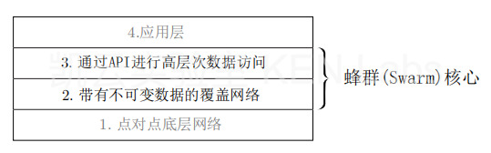
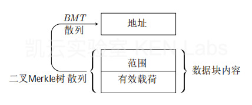
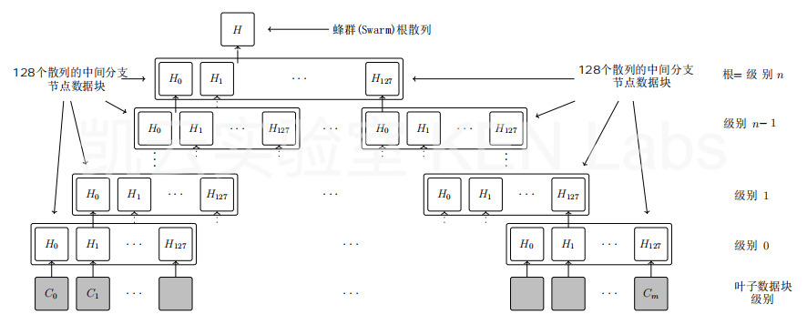
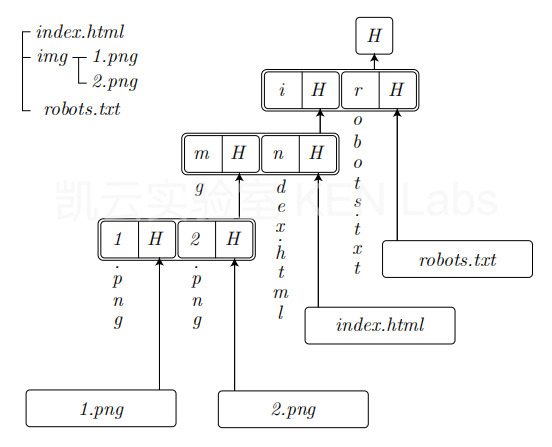

# 《蜂群》白皮书精简版

——自主数字社会的存储和通信基础设施

蜂群(Swarm)团队撰写

凯云实验室翻译

v1.0, 2021年6月13日


蜂群(Swarm)是由众多节点组成的点对点网络。在这个网络中，节点通过共同协作来提供去中心化的存储和通信服务。蜂群(Swarm)系统在经济上是自我维持的。具体来说，蜂群(Swarm)的内置经济系统是由BZZ代币驱动，并由以太坊区块链上的智能合约强制执行。

在本白皮书中，我们首先介绍蜂群(Swarm)的网络层，然后介绍蜂群(Swarm)API提供的高级功能。在网络层，蜂群(Swarm)实现了一个固定大小数据单元的分布式存储（归档）系统。而蜂群(Swarm)API提供的高级功能使得蜂群(Swarm)成为一个可实施的开发堆栈和去中心化Web部署环境。


### 1 介绍

蜂群(Swarm)的使命是为去中心化的互联网提供可扩展的基础设施，并为未来塑造一个自主主权的全球社会和免许可的开放市场。蜂群(Swarm)的愿景是通过点对点的存储和通信来扩展区块链，以实现世界计算机作为去中心化应用程序的操作系统和部署环境。

蜂群(Swarm)提供服务的连续性和弹性，以应对网络中断或有针对性的拒绝服务攻击。作为一个免许可的发布平台，蜂群(Swarm)促进了信息的自由流动。凭借其独特的隐私功能，如匿名浏览、可否认存储（注解：deniable storage）、不可追踪的消息传递和不泄露元数据的文件表示格式，蜂群(Swarm)响应了日益增长的网络安全需求。

```
凯云实验室注：
deniable storage，译为可否认存储。关于deniable storage 的解释文献较少，译者认为，这里的含义是如果没有正确的解密密钥，可否认存储是指就不可能证明数据实际被存储。
```

蜂群(Swarm)内置的激励机制致力于带宽和存储资源的优化分配，这种激励机制反过来使得蜂群(Swarm)在经济上能够自我维持。蜂群(Swarm)节点可以跟踪在每个对等连接上的相对带宽贡献，而由于不对等的消耗而导致的超额债务可以由BZZ通证来解决。蜂群(Swarm)中的发布者必须花费BZZ来购买向蜂群(Swarm)写入数据的权利，并为长期存储预付一些租金。

蜂群(Swarm)采用模块化设计，并由明显可解耦的四层组成（见图1）。从技术上来说，第(2)层和第(3)层构成了蜂群(Swarm)的核心，本白皮书将在以下两部分进行讨论。



图1：蜂群(Swarm)分层设计


### 2 “蜂群全球硬盘”：分布式不可变块存储

“蜂群全球硬盘”（*DISC,Distributed Immutable Store of Chunks*）是蜂群(Swarm)的底层存储模型。“蜂群全球硬盘”由节点组成，这些节点通过协作来存储和服务数据。当每个节点都以利润最大化作为运营者的策略时，网络整体的行为将涌现出以下属性:

* 隐私保护和免许可上传下载
* 强大的抗屏蔽和抗更改能力
* 随着需求的增长，自动扩展
* 内容完整性保护
* 不再重要的内容最终将会被删除

任何拥有空闲存储和空闲带宽的人都可以作为节点运营者参与构建“蜂群全球硬盘”并获得奖励。当运营者安装和运行蜂群(Swarm)客户端软件时，一个新的节点将被创建并成为网络的一部分，每个节点本质上管理着蜂群(Swarm)“蜂群全球硬盘”的一部分。

在接下来的内容中，我们将定义什么是“蜂群全球硬盘”，并解释它是如何产生上述特性的。


#### 2.1 连通性、拓扑和路由

“蜂群全球硬盘”的最初职责是建立和维护一个节点网络，使所有节点都能在彼此之间传递消息。这种消息传递是通过使用libp2p协议的节点之间持久且安全的通信通道进行的。蜂群(Swarm)期望节点之间建立Kademlia连接：连接到其它节点的一个特定子集，这样，节点的局部决定将会导致全局最优的消息路由。

Kademlia假设每个节点都被分配了一个与它们的网络地址不同的**蜂群(Swarm)**地址。通过计算前缀比特位的数量，我们可以根据两个蜂群(Swarm)地址的相同前缀数量来定义它们的**邻近**程度。彼此最接近的节点形成一个完全连接的**邻居**。此外，每个节点从每个离散的邻近分类连接到更多对等节点（参见图2）。


图2：Kademlia连通性。一个节点的全连通邻域包含PO为d定义的最少8个节点。该节点还被连接到每个上返邻近桶d−1, . . . , 0中至少8个平衡对等节点。

最终形成的拓扑保证了中继在每一跳上将消息至少向其预期目标地址移动一步（见图3）。这种技术使消息可以在任意两个节点之间路由，即使节点之间没有直接连接。传递消息所需的跳数的上限是节点总数的对数，因此即使在一个非常大的网络中，任何两个节点传递消息总是能够互相到达。


图3：转发Kademlia中的请求-响应往返。这里有一个覆盖地址为…0000…的节点正在向目标地址为....1111...的节点发送请求，距离目标节点最近的在线节点是…1110…。前面的省略号表示请求地址和目标地址共有长度为n位的前缀，后面的省略号表示与路由无关的部分地址，因为该深度节点已经是唯一的。请求者将消息转发给他们知道的离目标地址最近的直连对等节点(黄色)。接收到消息的节点也采用同样的策略。递归地应用此策略，消息传递通过的节点形成一条链(黄色、橙色、蓝色)，每个节点至少有一个邻序（PO）更接近目标地址。消息转发路径中的中继节点记住发出请求的对等节点，这样当响应到达时，它们可以沿着相同的路线向后传递（即向回传递）。


#### 2.2 数据块与数据存储
蜂群(Swarm)中的标准存储单元称为数据块。每个数据块最多由4K字节的数据组成，并且每个数据块都有一个地址。由于数据块的地址与节点地址具有相同的地址空间，因此可以计算它们的邻近性。蜂群(Swarm)的存储方案规定，每个数据块都由一个地址接近块本身的节点来存储。

为了保持数据的机密性，数据块可以被填充到4K字节，然后进行加密。对于没有密钥的人，加密后的数据和随机数没有任何区别。即使对于未加密的数据块，节点运营者也没有简单的方法来确定构成数据块的内容。由于蜂群(Swarm)节点无法选择它们想要存储的数据块，加密、上下文的模糊性和无法泄漏的元数据都为它们提供了保护，使它们免受托管内容的责任。

为了将数据块上传到集群中，节点通过推送同步（push-sync）协议转发数据块，直到数据块到达它所属的**邻居**。然后，一条确认数据块已经存储的声明会沿着相同的路线传递回来。为了检索数据块，检索协议将请求（请求中包含数据块地址）路由到相关的邻域。如果转发路径中的任何节点在其本地存储中存有相应的数据块，则将其作为响应发回。


图4：推送，拉取和检索协议

节点使用同步（push-sync）协议持续地同步它们的数据块存储。这保证了每个邻居都冗余地存储属于其邻居的所有数据块。这种冗余增加了弹性，在邻近节点不可达的情况下，可以维持数据块的可用性。同步协议还确保在节点离线和新节点加入网络时，邻居的存储是一致的。


#### 2.3 转发、隐私和缓存

在蜂群(Swarm)中，消息路由是通过将消息递归地转发到离目标地址更近的地方，然后沿着相同的路线返回响应来实现的。

这个路由算法支持两个重要的属性：

* 请求者匿名
* 自动伸缩

发起请求的节点所发送的消息在各个方面都与仅转发请求的节点发送的消息相同。这种模糊性使得请求的发起人能够保护他们的隐私，从而促进无许可发布和隐私浏览。

由于参与路由检索请求的节点可以选择存储它们已转发的数据块，因此促进了分发的自动扩展。这种机会缓存的经济动力由下面讨论的带宽激励提供。


#### 2.4 蜂群(Swarm)计费协议

**蜂群计费协议（Swarm Accounting Protocol,SWAP）**确保节点运营者在路由消息方面进行协作，同时保护网络不受随意的带宽占用。当节点转发请求和响应时，蜂群(Swarm)会跟踪与每个节点的相对带宽消耗。

在一定范围内，对等节点参与服务对服务的交换。然而，一旦达到了限额，债务方可以等待，直到他们的债务随着时间的推移被摊还，或者可以通过发送支票，在区块链上以BZZ兑现（见图5）。

这个协议确保了蜂群(Swarm)在以下两个场景中是免费使用的：

* 上传或下载少量内容的人
* 愿意等待，直到他们通过在每个对等连接上提供互惠服务而获得信用

与此同时，对于那些希望付费的用户（上传或下载较大数据量）来说，这是一种快捷的体验。

从经济上讲，节点会帮助每个节点转发消息，因为每个成功地将请求路由到更接近目标地址的节点，在请求被成功服务时将获得BZZ。如果该节点本身不存储数据，那么它需要支付少量的费用来请求来自更近的节点的数据块。通过这样的交易，节点在服务请求时可以获得少量利润。这意味着节点会主动缓存数据块，因为在从更近的节点一次购入数据块之后，后续对同一数据块的任何请求都将获得纯利润。


#### 2.5 空间不足和垃圾回收

随着更多新内容被添加到蜂群(Swarm)中，每个节点有限的存储空间迟早会被耗尽。在这一点上，节点需要一个策略来决定应该删除哪些数据块来为新的数据块腾出空间。

每个蜂群(Swarm)节点的本地存储有两个子系统：储备（reserve）子系统和缓存（cache）子系统。

储备是一个固定大小的存储空间，专门用于存储属于节点邻近的数据块。一块数据是否被保留在储备中取决于它所附着的邮票。区块链上的合约允许预先购买一批BZZ代币的邮资。批发行授权持有人发行有限数量的邮票。然后这些邮票作为一个信托信号，表明用户在蜂群(Swarm)中保存相关内容的价值。通过这个价值来优先从储备中移除哪些数据块，存储节点可以最大限度地利用"蜂群全球硬盘”（见图6）。

邮票的价值会随着时间的推移而下降，就像仓库的租金会定期从批次余额中扣除一样。一旦邮票的价值不足，相关的数据块将从储备中移出，并放到缓存中。


图5：蜂群(Swarm)计费协议。该图说明了对等节点如何跟踪彼此的带宽贡献。从第0步两边的零余额开始，然后进行一段时间的消息交换，然后经过第1步，直到第n步，直到一方的债务达到一个阈值。债务可以随着时间的推移而减少，或者债权对等节点得到补偿。

缓存的作用是保留由于批次余额不足或距离节点地址太远而没有受到储备保护的数据块。当空间不足时，蜂群(Swarm)会定期对缓存进行修剪，修剪方法是删除请求时间最早的数据块。由于最近请求是受欢迎程度的合理预测器，具有更多SWAP收入的数据块将优先保留。结合机会缓存，这种垃圾收集策略最大化了运营者从带宽激励中获得的利润，而在网络级别上，实现了流行内容的自动伸缩。


图6：邮票优先级


#### 2.6 数据块类型
在前面，我们已经将数据块定义为"蜂群全球硬盘"中的规范数据单元。在蜂群(Swarm)中，有两种基本的数据块类型：内容寻址数据块和单个所有者数据块。

内容寻址数据块的地址基于其数据的哈希摘要（参见图7）。使用哈希作为数据块地址可以验证数据块的完整性。蜂群(Swarm)生成哈希摘要的方法是：在数据块的小段上生成二叉梅克尔树，然后在梅克尔树之上应用BMT哈希函数。



图7：内容寻址数据块的容量最多为4KB。首先根据内容生成二叉默克尔树哈希，然后在通过对span和默克尔树哈希的散列计算得到数据块地址。

单个所有者数据块的地址是通过对所有者地址和标识符的哈希计算而得到的。蜂群(Swarm)通过所有者的加密签名来证明任意数据块与标识符的关联来保证单个所有者块数据的完整性（参见图8）。换句话说，每个身份都拥有蜂群(Swarm)地址空间的一部分，在这个空间中他们可以自由地将内容分配给一个地址。


### 3 蜂群(Swarm) API的功能
除了数据块之外，蜂群(Swarm)还公开了用于处理更高层次概念的API，如文件、具有各种元数据的文件分层集合，甚至节点间消息传递。

这些API试图反映那些已经在Web上使用的API。进一步的新颖结构和数据结构可以映射到这些更高层次的模式之上或旁侧，为任何希望从“蜂群全球硬盘”提供的隐私和去中心化核心产品中获益的人带来了丰富多样的可能性。


图8：单个所有者数据块。数据块内容由块头和最多4KB的有效载荷组成。最后一个报头字段是前面的8字节范围（span）前缀，这和内容寻址数据块的布局一样。前两个头字段提供了单一所有者证明（完整性）：一个标识符和一个在标识符和BMT散列（span和有效载荷）之上的签名。地址是id和签名者帐户的哈希结果。


#### 3.1 文件和集合

大于单个数据块所允许的4K字节的数据被分成多个更小的数据块。一组属于一个大数据块的多个小数据块由一个蜂群(Swarm)哈希树表示，该哈希树编码了文件在上传期间被分割成多个小数据块的方式。该哈希树由一组包含数据本身的叶节点数据块组成，这些数据块由一个或多个中间层数据块引用，每个中间层数据块包含对其子节点数据块的引用（参见图9）。

然后，整个文件的内容地址由根数据块的哈希摘要确定，即生成整个文件哈希树的梅克尔根。这样，文件的地址就变成了文件本身的校验和，从而可以验证内容的完整性。将文件表示为数据块的平衡梅克尔树还提供了对文件的有效随机访问，因此，可以提供有效地范围查询。 

为了表示集合，蜂群(Swarm)使用了**清单（mainfests）**。清单对通用字符串引用的映射进行编码，允许清单对目录树、键值存储或路由表建模。这些建模分别使蜂群(Swarm)能够实现为一个文件系统，一个数据库，甚至为网站和dapps提供虚拟主机。 

清单提供基于URL的寻址。如果我们把URL的主机部分解释为引用，而URL路径用作在映射中查找文件的键（清单表示文件的引用）。



图9：Swarm哈希：输入数据被分割成4K字节的数据块（灰色），这就是BMT哈希。BMT的散列从级别0开始被打包成中间数据块，直到级别n的一个数据块。

清单对映射进行编码，映射以压缩的梅克尔trie树的形式表示，包括序列化trie树节点的数据块（参见图10）。当查找路径时，我们只需要检索我们所遍历的分支中与节点对应的数据块。这确保了文件和记录的有效查找，其延迟和带宽开销是集合大小的对数。



图10：清单数据块表示一个压缩trie树的节点。这些节点通过键的下一个字节索引来保持连续。连续指定对文件的引用，包含键的剩余部分。或者，如果仍然有几个连续，则指定与路径上的下一个分叉以及最长的共享前缀对应的trie树节点的引用。

用于文件的哈希树中间块中的子节点引用，以及用于集合的清单trie树节点，在位置上与BMT哈希分段对齐。因此，蜂群(Swarm)支持压缩证明，即证明特定的数据段是在给定URL和给定偏移量处的文件的一部分，这是可公开证明的数据库索引和免信任聚合的基础。


#### 3.2	跟踪更新：订阅流（feeds）和域名解析

订阅流(feeds)是单个所有者数据块的例子，也是构建可变资源的一种方式。订阅流(feeds)可以表示可变资源的版本化修订、特定主题的连续更新或通信通道一方发布的连续消息。

订阅流(feeds)的工作原理是：通过定义从主题和索引派生的单个所有者数据块的标识符，当发布者和内容使用者就索引的更新方式和时间达成一致时，就可以构造和查找对订阅流(feeds)更新的特定引用。

类似于DNS将域名解析为主机服务器的IP地址，蜂群(Swarm)通过使用以太坊域名服务（区块链上的一组智能合约）将其解析为人类可读的域名（例如swarm.eth）。

每当Web应用程序或其所代表的网站由于更新而获得新的蜂群(Swarm)引用时，也可以更新在ENS中注册的引用。或者，当域名引用订阅流(feeds)时，用户可以从人类可读的域名中获益，同时也可以更新域名内容，而无需为每次更改与区块链交互并支付相关交易成本。


#### 3.3 消息

PSS (Swarm的邮政服务)是蜂群(Swarm)中用于节点到节点直接传递消息的协议。PSS的实现方式是：为目标接收者加密消息，然后将加密后的消息与主题封装在指定的内容寻址数据块中。由于数据块是按照其内容地址属于邻近接收者的方式设计的，因此推送同步（push-sync）协议自然会处理消息传递。

```
凯云实验室：     
这里的意思是说，消息的传递方式复用了数据块的上传方式，即推送同步（push-sync）协议。为区分起见，可以将这种由消息组成的数据块称为消息块。   
```

此外，对于任何第三方节点来说，难以区分由消息组成的数据块与随机加密的数据块，因此消息数据块也被称为：“特洛伊”数据块。期望接收PSS 消息的节点将尝试解密并打开到达其邻近区域的所有数据块。合法接收者成功接收并解密“特洛伊”数据块之后，客户节点可以使用PSS API将明文消息发送给订阅该主题的应用程序。

PSS还提供了消息的异步交付。因为消息组成的数据块是被持久化的，最终才同步到所有邻近节点，即使这些邻近节点稍后才上线。

由于PSS允许用户接收来自未知身份的消息，因此它是向公开身份发送匿名消息的理想通信原语。例如，注册、通过使用feed设置安全通信通道来启动线程的初始合约。因为PSS不需要接收方的任何操作（例如轮询），所以它是推送通知的理想原语。


#### 3.4 固定与恢复

“蜂群全球硬盘”最终会“忘记”（删除）那些很少被访问并且没有付费的内容。通过数据块**固定（pinning）**，节点可以确保它们将在本地保存特定内容。然而，这样的**本地固定者（pinners）**可以被动或主动地参与到内容**恢复**过程中来，这符合所有用户的利益。 

被动式恢复涉及到一个恢复协议。这个协议是指在检索失败的情况下，检索节点可以使用PSS发送一个恢复请求，将丢失数据块通知给固定者（pinner）。固定者（pinners）侦听恢复请求，并通过重新上传丢失的数据块来响应，检索应用将在重试时找到该数据块。这种后备恢复功能还支持直接从发布服务器节点获得原始内容的种子，这类似于一些现有文件共享解决方案（BitTorrent、IPFS）的主要操作模式。

相反，当固定者（pinners）主动检查网络中内容的可用性，一旦发现数据块丢失，就重新上传该数据块。这相当于为系统提供了主动恢复，或者是**数据管理（data stewardship）**。


### 4 结论

蜂群(Swarm)是作为节点的点对点网络引入的。网络中的节点通过集体协作，共同提供分布式存储和通信服务。蜂群(Swarm)在互联网之上构建了免许可、私密、自由表达、数据主权和开放市场，同时保持数据的安全性与完整性保护，具备抗审查能力和抗攻击弹性。

本白皮书介绍的功能是Bee 1.0启动主网时所包含的功能。

有了主网这个里程碑，旅程才刚刚开始。加入蜂群(Swarm)，收获数字自由。

想要更深入地了解蜂群，请继续阅读《**蜂群之书**》。

```
凯云实验室：

《蜂群之书》正在翻译之中，欢迎访问凯云实验室的GitHub页面：https://github.com/kenlabs/The-Book-of-Swarm，参与和贡献该书的翻译工作。
```