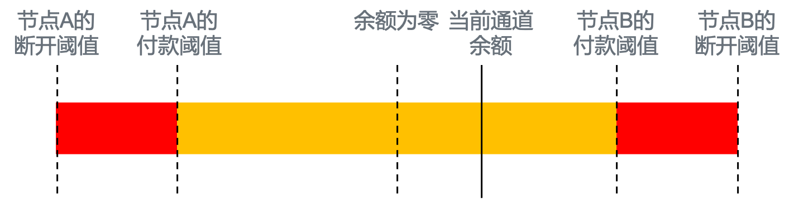

# 第三章 激励

## 背景

Swarm网络由许多独立的节点组成，每个节点上运行软件都实现了Swarm协议（见第8章）。重要的是，我们要认识到，即使每个节点运行相同的协议，网络的涌现行为不能由协议单独保证。由于节点是自治的，它们可以“自由”地对对等节点的传入消息作出任何它们想做的反应。无论如何，让节点以一种有利于网络的方式作出反应是有利可图的，而以一种有害的方式作出反应则是代价昂贵的。总体来说，这一点是通过使价值从使用资源的节点（网络用户）转移到提供资源的节点（网络提供者）来实现的。


## 3.1 共享带宽

##### 3.1.1 服务激励和中继激励

*Kademlia转发和重复交易* 

从原则上说，数据块的检索是由内容访问者发起的，因此，与检索相关的所有成本都应该由发起者承担。但是当今的网络是“免费的”，付费检索听起来不太符合大众的消费习惯。当前网络的主要问题源于消费者无法与内容发布者直接分担数据托管和分发的成本。检索的原理是，数据块的检索可以被视为一个功能单元，其中存储者充当服务提供者，请求者充当消费者。当服务由提供者提供给消费者时，消费者理应向提供者提供补偿。这样的直接的补偿交易通常要求交易方彼此知道对方的，但是如果还要满足匿名下载的需求，我们必须以一种创新的方式来做概念化补偿。

在我们使用Kademlia转发时，对数据块的检索其实包含了转发节点执行的一系列中继动作。因为这些都是独立的参与者，所以有必要对每个独立的转发行为进行激励。这个过程中最重要的是，如果只有中继节点是重要的，那么，无论记账和补偿的细节如何（见第3.2.1节），交易处理的逻辑都应该被限制在相互连接的对等节点之间。鉴于连接的对等节点集合是跨会话的准永久集合，这允许我们在重复交易的上下文中构建交互。这样的设计会为参与各方创造额外的激励：相互协作使网络工作的更好。所以，节点更愿意选择历史记录清白的对等节点是合理的。此外，由于这个准永久集相对网络规模来说是对数级规模，那么，对等节点重复交易需要的任何记账或智能合约都是可管理的，这提供了一个可伸缩的解决方案。反过来说，我们可以说，每个节点保持有限数量的连接，原因在于管理有限数量的对等节点的balance，以及保持请求源的多义性。比如，节点的实现选择更精简的Kademlia 蜂箱（bin），而Kademlia的分布式本质，意味着无法绝对地将节点ID以1对1的形式与节点地址映射。这种情况下，每个节点只能维护一份网络节点子集的映射表。这正是每个节点只能有有限数量连接的原因。

*反向响应付费* 

如果转发节点接受检索请求就可以获得收入，即在数据交付之前就触发了一个记账事件（这个事件将会被记录在下游节点），那么转发节点就可能产生不转发数据的反常动机。将接受检索请求的收入依赖于成功检索是一种自然的解决方案：只有将数据块交付给请求者时才会触发记账事件，见图20。


图20：激励检索。节点D （Downloader）向数据块的地址发送一个检索请求。检索请求使用了转发节点，所以请求通过转发节点F0,…,Fn，一直到节点S，即最靠近数据块地址的存储节点。数据块通过沿着相同的路径传回到节点D 。接收数据块的响应将触发一个记帐事件。

但是，如果发起一个请求没有任何成本，那么攻击者就可以为不存在的数据块（随机地址）发送许多非法请求。通过惩罚向不存在数据块发起请求的对等节点，可以减轻这种情况（见第3.2.7节）。

一旦节点发起（启动或转发）数据块请求，如果在定义的生存周期（TTL）内获得该数据块，那么请求节点会为该数据块支付的费用（提交付费请求）。因此，当该数据块往回传递时，就不存在阻碍及时交付的动机。这种承诺也阻止了节点轻率地向太多的对等节点请求数据块，因为，如果多个对等节点响应并成功交付，则请求者必须向每个响应节点付费。

 **3.1.2 数据块检索的定价协议**

接下来，我们描述Swarm网络的节点交付数据块的定价协议。在此协议的基础上，节点可以实施自己的策略，从而在服务质量和定价方面与其他节点竞争（见第9.3节）。

*价格发现*

该协议的主要优点是，价格发现机制仅基于本地决策。这是很关键的，原因如下：

* (1)带宽成本在世界各地是不同的：允许节点通过定价来表达其成本结构，从而在价格和服务质量方面形成竞争优势，最终使终端用户受益。

* (2)由于使用率或连通性的波动，对带宽资源的需求是不断变化的。
* (3)能够直接对变化做出反应，就能创造一个自我调节的系统。

实际上，如果没有价格发现机制，节点运营者可能会在成本上升时关闭节点，或者，在成本或需求下降时，终端用户可能会在一段时间内支付过多的费用（因为节点没有相应降低价格的竞争压力）。

带宽是一种“即时满足”的服务，因此立即确认和核算其成本是合理的。由于很难想象带宽的总体需求和供应中存在的任何外部性或非线性，因此定价机制最有可能适应全局最优资源分配策略。定价机制既提供了(1)高效和即时的信令，也提供了(2)具有最小切换和发现成本的竞争性选择。

为了实现这一点，我们引入了一个协议消息，它可以将这些价格传递给上游对等节点（见第8.4节）。我们可以将此消息概念化为对请求的另一种响应。节点为每个邻近距离的每个对等节点维护相关联的价格，因此当节点发出检索请求时，节点已经知道下游对等节点在生存期内成功交付有效数据块时承诺支付的价格。然而，将价格信号仅仅局限于请求的响应是没有意义的：无论出于何种原因，一个对等节点决定改变价格，即使不是响应请求，交换价格信息也符合双方的利益。为了防止价格变化消息充斥上游对等节点形成DoS攻击，价格变化消息的速率被限制。表现良好、价格有竞争力的节点会受到对等节点的青睐；如果一个节点的价格设定过高，或者其价格的波动性比网络中的其他节点高得多，那么其他节点就不太愿意向它们请求数据块。

注：虽然这里建议，不合理的定价是由市场的力量来处理的，但为了防止剧烈价格波动造成灾难性的节点连通性变化，需要在协议级别限制价格变动速率。

为了推理的简单性，我们假设默认价格为零，对应免费服务（利他策略，见第9.3节）。

*数据块差别定价*

如果数据块的价格在所有的临近节点都是相同的，那么除了缓存数据块并转售来赚取收入之外，节点没有转发请求的真正激励。对于新数据块来说，这个结果是不合理的，特别是当新数据块只位于很少邻近节点时，它们不太可能被请求。更重要的是，如果数据块在邻近节点的定价都是一样的，那么合谋节点就可以产生数据块流量，并获得它们发送的金额，这实际上是一次免费的DoS攻击（见图21）。


图21：邻近节点的统一数据块价格将导致DoS攻击。攻击者向S发送只有S可以服务的检索请求，在两个节点D和S之间创建一个流量。如果相邻节点的价格相同，则这种攻击不会给攻击者带来任何成本。

为了减少这种攻击，当请求从请求者路由到存储者时，请求者为数据块付出的代价必须严格大于存储节点所得到的补偿。我们需要有一个奖励转发节点的定价方案，因此，这就需要根据节点邻近程度进行差异化定价。如果一个节点离数据块越远，交付价格越低，那么请求总是可以以这种方式发送，因为转发节点将赚取差价，从而获利。这意味着，一个有效的差异化方案将收敛到一个定价模型，在这个定价模型中，如果对等节点距离数据块地址更远，交付成本更高，也就是说，对数据块交付的奖励是一个接近度递减的函数。

由于沿交付路径和邻近节点的竞争压力，我们预计节点对下游定价的差分作用是收敛到转发节点的边际成本。下游价格由节点的蜂箱（bin）密度决定。假设基数为2n的平衡蜂箱（bin）[TODO：结合蜂箱的原理，详细解释这一点]，一个节点可以保证在一跳中增加n的临近序。同时，这也意味着他们可以将成本分摊到n个邻近的箱子上，从而降低整体价格。

*跨对等节点统一定价*

以节点A为例，该节点需要转发一个数据块请求，该数据块属于A的PO蜂箱（bin） n。请注意，A的所有其他对等节点在蜂箱（bin） n+1,n+2，…,就像A的PO蜂箱（bin）中也有n。如果一个对等节点B的PO蜂箱（bin） n的价格比A更便宜，A可以降低PO蜂箱（bin） n的价格，所有后续流量都转发给B，并赚取差价，如图22所示。注意，这对于网络不是最好的，因为它在路由中引入了虚假的跳数，也就是没有增加临近性的中继。


图22：价格套利。节点为每个对等节点的每个邻近订单保持一个可定价的价格。图中显示节点0101试图转发0000的检索请求。箭头从最近的节点开始，指向其他节点，虽然离数据块更远，但提供更便宜的转发价格。选择价格较低的对等节点将把流量从价格过高的对等节点分流出去，并导致双方都面临调整的压力。

类似地，A的对等节点在较浅的蜂箱（bin）中，其各自蜂箱（bin）的价格低于A。例如，B(n−1)比A (n)便宜，那么A就可以将任意请求转发给B，并赚取差价。

现在让我们假设所有对等节点都有随着PO减少而单调递减的价格表。还假设，对于小于n的蜂箱（bin），较浅的桶具有较高的价格，而大于n的桶中所有较深的对等节点对于n都具有相同的价格。设B、C、D和E是桶n中密集均衡的对等节点。A希望将一个数据块转发给对等节点，使其目标地址PO增加3。如果对等节点B和C试图合谋对抗A，并提高转发数据块到bin n + 3的价格，他们仍然受D和E在PO 蜂箱（bin） n + 2上的价格的约束。特别是当n+3的值小于B和C时。

这种价格差异为节点提供了套利机会。转发到最便宜的对等节点的策略将把流量从昂贵的对等点分流出去，增加便宜的对等节点的流量。因此，价格将会调整。

在其他条件相同的情况下，这种价格套利策略将实现(1)整个网络相同PO的统一价格，(2)价格根据邻近性函数线性下降(3)节点可以增加连接性并保持较低价格。通过这种方式，奖励机制的设计使得有利于单个节点的策略也被整齐地对齐到全网，从而有利于整个系统的健康发展。

*蜂箱（Bin） 密度*

基于下游对等节点与区块的邻近性进行计费具有重要的影响：即非本地转发到请求者的单次净收入是邻近性差异（数据块与转发节点本身的临近性与与对等节点的临近性之差）的单调递增函数。换句话说，一个转发请求跨越的距离越远，我们赚的就越多。

这种激励与下载者的利益是一致的，即在服务他们的请求时节省路由跳数，从而降低延迟交付和带宽开销。该方案鼓励节点在其Kademlia 蜂箱（bin）中保持尽可能深的无间隙平衡地址集合（见图5），也就是说，节点保持密集的Kademlia 蜂箱（bin）比保持稀疏的Kademlia 蜂箱（bin）更好。

能够维护更密集蜂箱（bin）的节点实际上与更稀疏蜂箱（bin）的节点具有相同的成本，但节省跳数将改善延迟，并使对等节点更有效率。这将导致对等节点比其他具有相同价格的对等节点更受青睐。流量的增加也会导致带宽的争夺，最终导致价格的提高。

请注意，这种套利在较浅的蜂箱（bin）中更有效，因为蜂箱（bin）中可供选择的对等节点数量较高。这与责任领域的深蜂箱（bin）是相互对立的。如果一个节点不复制它的邻居数据块，那么离该地址较近但离该节点较远的节点将需要请求其中的一些数据块。这只会是可能的损失。邻居复制他们的责任区域的另一个激励在第3.3.2节中讨论。但是，节点存储了责任区域后，可以任意设置它们的价格。[TODO:这一段解释的不够清楚]

*缓存和自动扩展*

节点每服务一个数据块就会获得奖励，因此基于数据块的盈利能力与数据块的受欢迎程度成正比：相对于"存储/时间单位"的固定成本，数据块被请求的频率越高，其奖励就越高。当节点达到存储容量限制并决定删除一些数据块时，理性利润最大化的最优策略是删除利润率最低的数据块。一个比较好的预测方式是根据最后请求年龄。为了最大化可选择的数据块集，节点会愿意缓存它们所中继转发的数据块以及它们同步的数据块。这将导致流行内容更广泛地传播和更快地服务，使整个Swarm成为一个自动扩展和自动平衡的内容分发网络。

比最后请求年龄更好的预测数据块盈利能力的指标，有待进一步的确定和发展（另见第9.7节）。

*无缓存节点*

任何留给中继节点的利润方案都为非缓存（仅转发）节点进入网络创造了积极的激励。这样的节点对网络本身并没有好处，因为它们会产生不必要的带宽开销。一方面，无缓存节点的存在原则上可以减轻存储节点作为中继转发的负担，所以在近蜂箱（bin）中使用可能没有坏处。另一方面，在邻近深度更接近的情况下，无缓存节点的对等节点会倾向于选择缓存/存储节点，因为对等节点会做这样的假设：至少数据块在存储节点的责任区域内。无缓存节点也有助于增加匿名性（见第2.3.1节）。

##### 激励推送同步

推送同步（参见第2.3.2节）是一种协议，它确保上传到网络的数据块到达其正确的地址。接下来，我们将解释如何激励转发节点。

推送同步协议类似于检索协议，两者各自的消息交换序列通过相同的路由。推送同步协议中的数据块传递类似于检索请求，相反，推送同步中的托管收据语句类似于检索中的数据块传递响应。

推送同步原则上可以没有明确的转发激励。根据检索协议，节点希望数据块存储在块地址附近的节点上，Swarm中的参与者至少有微弱的激励参与协议来帮助上传的数据块到达存储目的地。但是，我们需要提供比请求者节点更远的节点（轻节点或重试）上传数据块的可能性。因此，如果推送同步是免费的，节点可能会产生大量浪费的带宽。

只支付下游对等节点的推送同步交付会使转发节点在数据块的交付上与存储节点讨价还价。数据块的占有对于未来的存储节点来说是最有价值的，因为存储也有一个激励系统（见第3.3.2节）。考虑到这一点，转发节点理论上可以持有该数据块，除非存储节点支付略高于拥有该数据块的价值，考虑到存储激励带来的潜在利润。特别是，由于来自上传者的路由上的转发节点并不多，任何来自存储奖励机制的利润都可以被转发节点捕获。

相反，在推送同步中，通过将保管收据的声明变成付费消息，角色互换。现在，转发节点不处于讨价还价的位置。要了解原因，请考虑如果一个转发节点试图持有一个数据块，以获得将该数据块推入存储节点的价格，会发生什么情况。在这种情况下，上传者将不会在合适的时间内获得保管收据声明，假设尝试失败，并通过不同的路由重新上传数据块。现在，原来的转发节点突然被迫与另一个转发节点竞争，以获得带宽成本的补偿。由于所有转发节点都知道这一点，突发行为将产生一系列愿意将数据块转发给存储节点的对等节点，以获得很小的补偿和产生的带宽成本。现在，原始转发节点不需要在第一时间尝试与存储节点讨价还价：相反，它们可以在返回保管收据声明时立即获得少量利润。

注：为了补充我们的带宽补偿解决方案，需要采取进一步的措施来防止垃圾邮件和鼓励存储，这将分别在后面的第3.3.1节和第3.3.2节中讨论。


图23：推送同步协议的激励。节点U（上传者）通过转发节点F0、…Fn。存储节点响应一个托管收据声明，该声明通过相同的转发节点Fn、…F0。接收保管收据的声明会触发一个记账事件。

这个方案清楚地说明了为什么这两个协议的激励依赖于相同的前提：同一种商品（托管收据声明）有许多卖家（转发人），而只有一个买家（上传者）。这将使服务的价格（将数据块交付给存储节点）达到转发沿途每个节点的所有边际成本的总和，同时允许存储节点从存储补偿方案中获取所有利润。

通过这种方式，我们可以确保(1)存储节点实际响应收据，(2)有一种方法来检测超时或未经请求的收据响应，以防止DoS，见图23。

就像在检索协议中一样，定价对于不同的邻近性是不同的（见第3.1.2节），并且随着网络中节点的成本变化（取决于节点的容量利用率和效率），定价也将随时间变化。由于在计算补偿时，补偿将针对一个数据块和一个较短的消息（检索请求和托管收据），我们可以有把握地得出这样的结论：价格结构转发的两个协议都是相同的，因此可以使用一个通用转发定价方案为（见第3.1.2节）。一个区别是：不同数据块的检索协议交付可以验证其完整性，推送同步中的记账事件是一个可以被欺骗的托管声明。有了转发激励，节点将有动机不转发和模拟存储节点并发布托管声明。这使得通过替代路由查询（检索）数据块是明智的。如果这样的检索失败，可能需要尝试通过替代路由推送同步数据块。

## 3.2 SWAP：记账和结算

本节介绍与带宽共享相关的激励机制。在第3.2.1中，我们引入了一种机制来跟踪对等点之间的数据流量，并为消息中继提供对等计费。随后，在第3.2.2中，我们描述了补偿收支不平衡服务的条件，并展示了如何结算这种补偿。我们特别介绍支票和支票薄智能合约的概念。在第3.2.3中，我们讨论了豁免，一种进一步节省交易成本的机制。在第3.2.5中，我们讨论在现金交易中，发送服务如何以零现金进入Swarm。最后，在第3.2.7中，我们将讨论基本的制裁机制，作为一个基本的激励，让节点更好地参与系统和遵守协议。

#### 对等节点记账

[Tron et al.， 2016]引入了一种点对点记账协议，称为swap。swap是一种针锋相对的记账方案（见第8.7节，最新版本白皮书这一部分为空白），并可以扩展微交易。该方案允许直接连接的对等节点交换支付或交换支付承诺。系统的主要功能包括（通过SWAP所代表的不同的缩略词来帮助记忆）：

* 服务需要（wanted）和服务提供（provided）的Swarm计费协议——服务交换的记账服务。
* 自动付款结算——超过付款阈值时发送支票。
* 将豁免作为付款——债务可以豁免（以未兑现的支票形式）。
* 零现金启动并向对等节点发送数据——零现金进入，支持单向交换。

```
译者注：以上功能的英文单词都可以缩写为SWAP，为了便于阅读，这里不再给出这些功能的英文表示。
```

*服务对服务* 
Swap允许在连接的对等节点之间进行服务交换。在等量消费的情况下，随时间变化的方差很低，双向服务的记账互相抵消，不产生支付。数据中继就是这种服务的一个例子，使得Swap非常适合在内容传输网络或网状网络中实现带宽激励。



图24：Swap余额和Swap阈值。中间的零余额表示消费和供给相等。当前通道余额表示未支付报酬的服务提供的差额：如果在零的右边，余额向A倾斜，B负债；如果在零的左边，余额向B倾斜，A负债。橙色的区间表示损失容忍区间。如果余额超过支付阈值，负债一方就向其对等节点发送支票，如果它达到断开阈值，负债一方就会被断开连接。

*支付结算*

在存在服务消费不均等（较大差异）的情况下，余额最终将显著地向其中的一个对等节点倾斜。在这种情况下，负债一方向债权人支付一笔款项，并将名义余额设置为零（重新归零）。这个过程是自动的，并由Swap保证支付（*settle (the balance) with automated payments*，用自动付款结算（余额））（见图24）。这些支付可以只是承诺。

*支付阈值*

为了量化什么是“显著倾斜”，Swap协议要求对等节点将支付阈值作为节点握手的一部分（8.7）：当债务超过这个阈值时，它们发送一个消息，消息包含了向对等节点支付的款项。让任何节点都可以在这个阈值级别发送消息是合理的，因为还存在一个断开阈值。任何对等节点都可以自由设置断开阈值，但一个合理的值应该是，支付阈值和断开阈值之间的差额解释了两个对等节点记账余额的常规变化。(见9.4)。

*原子性*

如果不大大增加复杂性，发送支票并更新接收方的余额就不能进行原子操作。例如，客户端可能在接收消息和处理消息之间崩溃，所以即使发送端返回没有错误，发送端也不能确定是否收到了支付，这可能导致双方的会计差异。由两个阈值（断开阈值−支付阈值）之间的差异所表示的容忍度可以防止这种情况的发生。也就是说，如果此类崩溃的发生概率不高，并且在两个对等节点发生崩溃的概率大致相同，那么由此产生的微小差异就会被过滤掉。通过这种方式，节点免受经济处罚。


图25：对等节点B的swap余额（对应于A）达到支付阈值（左），B向对等节点A发送一张支票。B保留支票并将swap余额设置为零。

#### 支票作为链下支付承诺
区块链网络中直接链上支付的一个主要问题是，每笔交易都必须由参与网络的每个节点来处理，导致交易成本很高。然而，创建支付而不上链是可能的。这种支付被称为二层支付策略。其中一种策略是延迟付款并批量处理。为了降低成本，受益人必须愿意承担更高的结算失败风险。我们认为这在Swarm的带宽激励中是完全可以接受的，因为Swarm中的对等节点需要重复进行交易。

*支票合约*

文献[Tron et al.， 2016]引入了一个非常简单的智能合约，允许受益人选择何时处理付款。这种支票合约是一种钱包，可以处理其所有者签发的支票。这些支票与传统金融交易中使用的支票类似：发行方在支票上签字，注明受益人、日期和金额，然后将支票交给收款人，作为承诺在以后的日期支付的标志。智能合约扮演着银行的角色。当收款人希望得到报酬时，他们就会通过将支票提交给智能合约来“兑现支票”。合约在确认签名、日期和支票上指定的金额后，将金额转入受益人的账户（见图26）。类似于拿着支票去银行兑现，任何人都可以在交易中把数字支票发送到所有者的支票账户，从而触发转账。

Swap协议规定，当超过支付阈值时，债权人将发送一张支票。这样的支票可以立即送到发行人的支票合约中兑现。或者，支票也可以持有。持有支票实际上是信用贷款，它使交易双方可以节省交易成本。

存入支票的金额（全局余额）作为支票的担保（质押）。它汇集了所有未兑现支票的受益人。在这种最简单的形式中，支票本与真实世界的支票具有相同的保证：就是没有保证。由于资金可以在任何时候自由地从支票钱包中移出，兑现时的偿付能力永远无法得到保证：如果支票簿的余额少于提交支票所批准的金额，支票就会退票。这是交易成本和结算失败风险之间的权衡。

虽然严格来说，不能保证偿付能力，在资不抵债的情况下也没有明确的惩罚措施，但空头支票会影响发行人的声誉，因为支票合约会记录这一点。支票是在重复交易的背景下进行交换，在这个前提下，对等节点将避免发行超出其余额的支票。换句话说，一个节点希望在对等节点中保持良好的声誉，这足以激励其维持偿付能力。


图26：交换支票簿的基本交互序列

*双重兑现*

由于这些数字支票是文件形式保存，因此可以被复制。因此必须注意，同一张支票不能兑现两次。通过指定给某一受益人支票的序列号来防止这样的“双重兑现”。当支票兑现时，合约将把这个序列号储存起来。然后，支票簿合约可以依赖序列号来确保支票按顺序兑现，因此只需要为每个受益人存储一个序列号。

当向同一受益人重复付款时，防止双重兑现的另一种策略是，支票包含曾经记入受益人名下的累计总额。在合约中为每个受益人保存了已兑现的全部金额。当提交一张新支票时，合约忽略金额等于或低于储存总额的支票，但如果收到金额大于储存总额的支票，合约将转移差额。

这个简单的技巧也使得大量兑现支票成为可能，因为只需要处理当前的“最后一张支票”。这实现了交易成本的降低。

*无ether兑现*

并不是Swarm中的所有对等节点都期望拥有Ether来支付交易成本并兑现支票。支票薄允许第三方兑现支票。交易的发送者将因所执行的服务而获得奖励。

3.2.3豁免

如果swap通道的失衡是由于高方差而不是不平等消费造成的，那么在一段时间的支票积累之后，swap通道余额开始向相反方向倾斜。通常，现在是由另一方向其对等节点发出支票，导致未兑现的支票在双方累积。为了进一步节省交易成本，能够“相互抵消支票”可能是可取的方案。

这样的过程是可能的，但它需要在支票簿合约中进行某些重要的更改。特别是，兑现支票不再是立即的，而且必须有一个安全延迟，这是其他支付通道实现所熟悉的概念。

让我们设想一个类似于将支票退还给发行者的系统。假设同对等节点A向B签发支票，从而使通道余额归零。后来余额向A倾斜，但从A寄给B的支票还没有兑现。在传统的金融世界中，用户B可以简单地把最后一张支票退还给A，或者证明已经销毁。在我们的例子中就没那么简单了。我们需要另一种机制，让B承诺不再兑现那张支票。这种承诺可以采取几种形式。可以通过B签署消息允许A发行一个新的“最新支票”，累计总额低于之前的总额。或者B可以向A的支票簿发行某种“负值”的支票，造成一个效果：一个相同数量的支票已经兑现。

所有这些实现的共同点是，支票薄不再允许立即兑现支票。在收到支票兑现请求后，合约必须等待对方提交可能遗漏的支票注销或总额减少的信息。为了适应使用单一支票簿的（半）双向支付，我们做了以下修改：

1. 从用户A到用户B的所有支票必须包含序列号。
2. A签发给B的每张新支票必须增加序列号。
3. A的支票簿合约记录了B最后一次兑现的支票的序列号。
4. 在兑付延误期间，有效的较高编号的支票将取代以前提交的任何支票，不论其面值如何。
5. 任何减少先前所提交支票的支付的提交支票只有在受益人签名的情况下才有效。

有了这些规则，很容易看到支票取消将如何工作。假设用户A向用户B开出了支票c0…cn，累计金额为t0…tn。假设B兑现的最后一张支票是ci，支票薄合约记录B收到了ti的付款，并且最后一张兑现的支票序列号为i。

让我们进一步假设，余额开始倾斜于A，总额为x。如果B已经兑现了支票cn，那么B现在必须以B的支票簿为来源，并指定A为受益人，签发一张自己的支票。然而，由于支票ci+1…cn未兑现，则B可向A发送以A支票薄为来源，B为受益人的支票，序号n+1，累计总金额tn+1 = tn−x。由于上面列举的规则，A将接受这等同于B支付的金额x。在这种情况下，B豁免先前的部分债务，而不是向A发送支票。这证明SWAP是发送豁免作为支付。

这个过程可以重复多次，直到累积的总额回到ti。至此，所有未偿还债务实际上已被豁免。如果有任何进一步的付款，则必须以从B的支票簿到A的适当支票的形式进行（见图27）。


图27：支票和豁免混合示例序列

*零现金启动*

Swap会计也可以单向运行。如果一方以零流动资金进入系统（新加入系统的节点），但与有资金的对等节点（系统内节点）连接，新加入节点可以开始提供服务（不使用任何服务），以赚取正的Swap余额。

如果系统内部节点有支票簿，他们可以用支票支付给新加入的节点。然而，这有一个警告：新加入节点将能够从提供的服务中赚取支票，但没有办法兑现支票。兑现支票需要向区块链发送交易，因此需要gas费用，除非该节点能够说服其中一个对等节点为其发送交易。为了实现这一点，节点可以在希望被发送的结构上签名，然后通过预处理步骤扩展Swap合约，这将触发给新加入节点的支付费用，包括交易的Gas成本和交易发送方的服务费。新加入节点的支票可能会被任何系统内部节点兑现（见图28）。这里的SWAP表示 start without a penny, send with a peer（从一分钱都不花开始，通过同行发送交易）。


图28：启动或如何作为一个具有swap能力的节点启动，通过消费和提供服务来赚钱。

在没有启动资金的情况下赚取少量金钱的可能性是至关重要的，因为它为新用户提供了一种无需购买代币就能访问Swarm的方式。这一好处通常延伸到以太坊生态系统：使用Swarm，任何人都可以赚到少量的钱，开始为他们的dapps支付Gas，而无需在上线前经历痛苦的获取代币的过程。

3.2.6 套现和破产风险

```
凯云实验室：Swarm一书并没有对这一部分进行介绍。
```

3.2.7 制裁和黑名单

本节为SWAP方案提供了附加的激励和保护措施，以应对欺诈行为。

*违反协议* 

在一个不可信的对等节点环境中，对不希望的对等节点行为进行微妙的制裁是很难的。然而，当节点违反交互的基本规则时，检测到它的节点可以简单地断开连接。为了避免试图重新连接导致的死锁，对违规节点施加的制裁还包括将对等节点的地址记录到黑名单中。这个简单的措施足以对违反协议的节点提供明确的抑制。

*过度轻率*

检索和pull-sync协议使用同一个激励结构，其中只有收到响应才会产生收入来源。尽管这形成了合作的强烈动机，但也有必要采取措施确保节点不会向网络发送没有成本的无聊请求。在pull-sync的情况下，特别重要的是不允许数据块没有成本地抹掉其他数据块。这将构成后面邮票部分的主题（见第3.3.1节）。

在pull-sync检索的情况下，攻击包括请求不存在的数据块，导致下游对等节点发起大量网络流量，以及一些内存消耗，因为请求在生存期内是持久存储的。当然，也可能确实出现请求不存在数据块的情况，而且请求的数据块可能被网络垃圾收集。在这种情况下，请求节点可能是善意的。

为了减轻这种情况，每个节点都保存了来自其他节点的检索请求数量的记录，然后更新失败请求的相对频率，即请求超时，即使相关节点已经转发了请求。如果失败请求相对于成功请求的比例过高，则对对等节点施加制裁：断开连接并将其列入黑名单。

通过记住节点转发的请求，节点可以将合法的响应与潜在的DoS攻击区分开来：对于检索，如果传递的数据块没有满足开放的请求，则认为它是未请求的；对于pull-sync，如果一个托管响应语句与转发数据块的现有条目不匹配，则认为它是未经请求的。

超时在这里至关重要。在请求的活动时间过后，打开请求的记录可以被删除，因此任何后续响应都将被视为未请求的，因为它与从未请求过的消息没有区别。

为了容忍时间度量上的差异，同样，在断开连接并加入黑名单之前，允许来自对等节点的一小部分非法消息。

*服务质量*

除了不请自来消息的速率外，节点还可能在其他方面影响服务质量，比如价格高、网络吞吐量低或响应延迟长。与过多琐碎请求类似，恶意的攻击和善意的劣质（质量差、价格过高）服务之间没有区别。因此，缓解服务质量的问题将在转发（见9.2）和连接（见9.1）中的对等节点选择策略中讨论。

```
凯云实验室：Swarm将服务质量与恶意攻击同样对待，这些内容都包含在对等节点的选择策略中。
```

*黑名单*

作为对对等节点的一种衡量，黑名单是一种断开连接的补充策略。黑名单以网络断开的行为表达来延伸我们的判断，即对等节点不适合继续来往做生意。特别是，在接受传入连接，以及对等节点的选择策略中，都应该参考黑名单。一方面，黑名单可以避免节点陷入恶意节点反复重连的死锁中。另一方面，必须注意不要将行为良好的对等节点列入黑名单，以免损害网络连接。

```
凯云实验室：黑名单，也是一种节点选择策略。
```

## 3.3 存储激励
在第3.3.1节中，我们引入了邮戳（ postage stamps）机制，主要是为了防止垃圾数据攻击。在第3.3.2节中，我们介绍邮资彩票，邮资彩票本来用于垃圾数据的Dos攻击保护，这里解释如何对其进行修改以创建积极的激励机制，鼓励存储节点存储文件。同时也鼓励上传文件的节点用邮资彩票来标识文件重要性。在第3.3.3节中，我们描述了如何使用定价机制作为网络容量压力的信号，以及如何使用激励机制来缓解这一点。最后，第3.3.4节展示了如何通过引入质押保险来补充邮资彩票所提供的积极奖励，这些保险提供者如果失去了他们承保的数据块，就可能失去他们的存款。我们认为，这种惩罚性措施对于缓解公地悲剧问题至关重要，因为公地悲剧问题会影响那些只实施积极存储激励的系统。

#### 3.3.1使用邮票来防止垃圾数据攻击

同步包括将数据块从上传者转移到存储提供者，即把数据块从进入网络的地方转移到节点责任区域内的邻近区域。存储节点的角色是通过用数据块响应检索请求来提供内容。在其他条件相同的情况下，给定Kademlia路由，节点离数据块地址越近，对该数据块的请求就越有可能到达这些节点。这使得存储节点同步和存储数据内容的激励很弱。然而，这个逻辑的前提是数据块有盈利的承诺。如果攻击者可以向网络发送从不被请求的数据块（可能是随机生成的），那么这种假设就不成立了。从网络的角度来看，这意味着无用的数据块将简单地替换有用的数据块，劣币驱逐良币。通过增加上传数据块的成本，Swarm可以减轻这种攻击。

```
凯云实验室：从检索获利的角度来说，根据Kademlia的路由规则，数据会存储在地址临近的节点上。那么其他节点就没有动力来同步和存储数据。从另外一个方面来说，根据数据的放置规则，如果上传数据没有成本，则很容易对存储数据的节点实施DoS攻击。
```

*邮票*

从国际邮件交付获得灵感，可以对整个交付路径（以及存储） 预付费。这种付费的证明被称为邮票，并且必须由发件人将邮票附在要发送的数据上。上传者不一定要承担这个成本，但是他们需要确保每个数据块都附上一个邮票，否则上传就不会成功。相反，这种首付不一定要作为收入支付给特定的任何一方，也就是说，它可以被烧掉或以其他方式重新分配。上传一个数据块的实际成本可以作为标识数据相对重要性（有点类似于加急邮件）的一个信号，存储提供节点可以使用这个信号来对数据块进行排序，在存储空间不足时，用来选择哪些数据块该保留和继续提供服务，哪些数据块可以作为垃圾回收（见第9.7节）。

邮票模型采用见证人的机制，构建和数据块关联的支付证明。见证人是由付款人指定的第三方实体发布的数字签名。

*支付证明*

支付证明可以有许多不同的实现方式。最明显的一个方法是在向区块链上的中心化邮票发行机构（也就是智能合约）付款。然而，由于交易成本昂贵，要求对每个数据块进行链上支付将是非常昂贵的。相反，我们需要一个解决方案，允许上传者以批量的方式购买邮票（邮票批次），然后在重用在多个数据块上。

邮票批次是与链上可验证支付相关联的id，它可以作为邮票附加到一个或多个数据块上。

```
注：使用支票似乎是一种选择，但是，因为支票是根据累积债务签署的，并且假定单个受益人能够使用先前发送的支票重构增加的价值。换句话说，支票不是向非对等节点传达价值的合适手段。
```


当交易发送到其创建端点时，由中心化邮票智能合约创建。和交易一起发送的还有以下数据：

* 所有者地址：有权使用批次创建带有邮票的数据块的所有者。
* 批次数量：该次付款将创建的批次数量。
* 批次深度：每一个批次可以创建带有邮票的数据块的对数。

支付这笔邮资后，智能合约便记录下列资料：

* 支付参考ID：一个随机ID，作为这次支付的引用。
* 每数据块的余额：该次支付将创建的批次的总金额，平均分配到每个数据块。
* 所有者地址：有权使用批次创建带有邮票的数据块的所有者。
* 批次数量：该支付创建的批量数量。
* 批深度：每一个批次可以创建带有邮票的数据块的对数。

所有者是在交易数据中指定的地址，并被记录为有权使用批次为数据块盖章的一方；如果未指定，则默认是交易发送方。

一个随机标识符会被生成作为支付的引用。支付交易将创建多个批次，其数量在交易中指定。最终将为每个批次分别记录批次深度。可以为每次支付创建新批次。这个支付覆盖的数据块的数量可以作为批次容量的总和来计算。初始批次深度应用于该次支付交易创建的所有批次。然后，与交易一起发送的BZZ通证数量将平均分配给该批次支付覆盖的所有数据块，即通证的总数量除以覆盖的数据块的数量。这个数额被分配给支付ID，以表示批次的每个数据块余额。然后，任何人都可以选择在稍后的日期充值这个余额。


图30：邮票是一个数据结构，由邮资合约的批次id、数据块地址和一个证明两者关联的见证签名组成。上传者和转发者必须为每一个上传的数据块附上一个有效的邮票。

附在数据块上的邮票是一个包含下列字段的数据结构（见图30和第7.7节中的规范）：

* 数据块地址——邮票所绑定的地址。
* 批次标识符：由一个支付标识符和一个可以用邮资智能合约检查其有效性的批次索引组成。
* 见证人：所有者的签名，连接批次标识符和所有者的地址。

邮票的“面额”是与批次相关联的每个数据块的余额。与用于邮政邮件的邮票类似，单个数据块可以有多个邮票附加在其上。在这种情况下，将附加到数据块的多个有效邮票的“面额”相加，形成总邮票“面额”。

*邮票的有效性*

核实邮票的有效性，须符合下列准则：

* 权威性：批次标识有效，即支付ID存在且已注册，且批次索引小于与支付ID关联的批次数。
* 已授权：见证人的签名地址指定为该批次的所有者。
* 资金足够：引用批次尚未用尽其余额，并有足够的资金以最新价格覆盖至少一个存储期。

所有这些都可以很容易地通过检查智能合约本身而得到。验证批次中包含的数据块数量小于批次中允许标记的数据块总数是至关重要的。如果没有进一步的措施，就有可能发生超支攻击。在这种攻击中，上传者在超过批次处理容量的数据块上重用邮票，从而诱使毫无防备的存储提供者进行低报酬的额外工作。

防止这种过度发行的保护不是微不足道的：在没有特定批次签名的所有数据块的全局信息的情况下，节点不能直接验证数据块数量，因为它们无法访问未通过它们转发的附加在数据块上的邮票。因此，节点需要有一种方法来共同防止过度发行，而每个节点必须仅仅根据本地可用的信息决定如何行动。

*通过限制前缀冲突来限制批大小* 

一个解决方案是在批次上强加一个明确的一致性要求：用相同批次标识符签名的数据块的前缀冲突不超过深度。批次大小为2d（2的d次方）的邮票可以被认为是深度为d的平衡二叉树，其中叶子对应批次的最大长度碰撞槽。如果一个批次的深度大于网络的深度（日志网络中节点的数量），然后，所有匹配相同碰撞槽的数据块都被保证落在相同的邻域，因此，节点可以局部检测到一致性要求的“违反”（见图31）。然后期望存储节点批量更正记录的深度。他们可以通过报告所有者发行的两枚邮票，并与当前记录的批次深度更接近的批次来对比进行更正。这样做的激励是，存储提供者有可能在已经支付的存储成本之上付出额外的存储成本。


图31:邮资批处理表示为二叉树，并将发行的邮票映射到批处理。叶节点位于与根相对应的级别，该级别与支付时设置的邮资批的深度相对应。叶子节点上的盒子可以被认为是前缀碰撞槽。在这个图中，灰色的盒子代表已经填满的槽，所以下一个块地址应该落入一个白色的。

由于数据块地址不太可能完美地分布在批次的碰撞槽上，上传者必须保留多个深度为d的批次来签名2d（2的d次方）数据块。通常，对每个邮票的最有效利用是填充所有不同的碰撞槽（见6.1）。换句话说，持续的不一致性将导致未充分利用的邮票，因此上传和存储每一枚邮票的平均单价会更高。这个解决方案有一个预期的副作用，它对不统一的上传者施加了预先成本：我们的上传越集中在邻居，就有更多的邮票槽未使用。通过这种方式，我们确保将太多的上传内容指向一个特定的令居是昂贵的，这对于稍后关于分散文件保险的讨论（见第5.3节）具有重要意义。

基于前缀冲突限制批次大小的另一个优点是，通过前缀冲突，可以估计邮票的绝对价值。这在以后设计邮票彩票时很有用（见第3.3.2节）。

为了使这些碰撞能够被检测到，在整个批次生命周期中，批次处理的大小需要大于估计的邻域深度。在任何情况下，如果批次的深度超过这个值，就不符合用户的利益，因为冲突前缀越长，就越难实现一致性和填充整个批次（见附录A.4）。

*使用加密进行数据块挖矿*

完全填充邮资批次的一个简单解决方案依赖于第2.2.4节中暗示的见解：选择加密密钥允许我们将数据块挖矿到特定的邮资批次。

寻找加密密钥以生成靠近地址的内容散列的过程类似于区块链中的区块挖矿。数据块需要32字节的密钥加密，也就是区块中nonce值的角色，那就是：它提供了足够的熵来保证一个节点是能够找到一个加密密钥，这样产生的哈希摘要加密数据块产生一个地址能够落到一个特定开放邮资批次的槽内。挖矿的难度是由批次深度决定的。

考虑健康的上传者，它拥有的邮资碰撞槽和要发送的数据块一样多。给定一个深度为d的邮资批次，它们用所选的密钥对数据块进行加密，这样生成的加密数据块的地址将填满开放邮资批次的自由碰撞槽。如附录（a .4）的分析所示，这种填充批次的策略平均每个数据块需要 0.69d + 1次试验，即8次、15次、22次每千、每百万、每10亿个节点。我们认为这具有合理的复杂性。


3.3.2邮资抽奖:储存的正面奖励
如3.2.1所述，Swarm的主要激励机制是为检索提供补偿，节点会因为成功服务了一个chunk而得到奖励。这种奖励机制还有一个好处，就是鼓励机会缓存。利润最大化的存储节点提供经常被请求的块，因此，确保流行的内容在网络上广泛分布，从而也减少了检索延迟。
只使用这种激励的另一面,是块很少检索可能最终失去了:如果不被访问一块很长一段时间,然后由于存储容量有限,最终它将垃圾收集,为新来者。为了保证数据的长期可用性，激励系统需要确保那些可能被删除的数据块能够产生额外收益。换句话说，不受欢迎的块不能从检索中产生足够的利润，应该补偿存储它们的节点所放弃的机会。本节介绍的邮资彩票，以公平的方式将来自邮票的收入重新分配给各存储节点，从而提供这样的补偿。
邮资彩票计划的核心是认识到，概率支付可以用来为存储节点创造收入。使用彩票可以让我们调整收益，从长远来看，每个区块都有相同的回报，同时节省了交易成本，并提供了抽查所必需的随机性。


比赛:抽奖，申请，索取和赚取
邮资彩票在EVM区块链上进行，并由智能合约管理。彩票流程由以下协议定义(正式见7.7)。

区块链上的每一个N-th6区块都标志着新一轮全球彩票发行的开始。随后的N个区块由三个阶段组成，这三个阶段代表了期望抽奖参与者发送交易以与抽奖智能合约交互的阶段:
1. 预提交-节点通过发送价格报价来预先提交抽奖挑战。作为有效的预提交事务的结果，定义了一组申请人。这一阶段的结束标志着见证批次的选择。
2. 提交-节点发送一个块的列表和它们的监护权证明，由见证批指示。作为有效索赔交易的结果，定义了一组索赔人。这一时期的结束标志着挑战的选择。
3.驳斥-节点发送挑战的驳斥。由于有效的反驳，一套最终获奖索赔人是确定的。这一阶段的结束以支付给获奖者的奖金为标志。
最后一节结束，新一轮抽奖开始。彩票和它的阶段也可以用首字母缩写race来描述，当然，还有一个详细描述阶段的助记方法:raffl - apply - claim - earn (race)。事件的时间轴如图32所示。

自动抽奖活动轮
RACE流程是通过抽奖阶段初始化的。首先，开始块的哈希与从0到n−1的整数一起哈希，以获得n张中奖票(r0，…Rn−1)每个代表一个独立的抽奖。一旦产生了这些中奖彩票，其地址靠近彩票ri的节点就可以申请参加适用的抽奖。
从网络的角度来看，这些抽奖是对存储节点的抽奖，而从存储节点的角度来看，抽奖代表了在集群内提供网络存储的确保补偿的手段。

应用:预先承诺抽奖挑战
在第一个交互阶段，为了申请奖金，所有靠近中奖彩票的节点必须向彩票合约发送一个交易，其中包括一个存储每个区块的价格报价。通过提交这样的价格，节点隐式地声明它拥有所有批次的所有块，其价值高于其责任范围内的价格。这个责任范围是由节点自己声明的，并且是预先承诺的一部分。

选择6n是为了让两轮之间的时间舒适地适应抽奖过程的所有阶段。
每轮需要多次抽奖，以校准一个节点赢得抽奖的预期频率。通过随着网络的增长而增加n，可以使存储服务获得补偿的预期时间保持不变。


主张:提交证明才能获胜
在此申请截止日期过后，抽奖将进入申请阶段，为每个申请人指定一批证人。这个见证批作为一个抽样检查，申请人声称他们存储了他们负责的所有块。与中奖彩票类似，见证批次的选择是基于关闭h1轮应用程序的块的块哈希提供的随机性。抽查由以下程序执行。首先，通过将blockhash h1和申请人的地址散列在一起创建一个锚，然后选择id最接近锚的批次，其值高于在应用程序中提交的价格。该批次作为随机的证人批次，申请人将根据该批次提交证据，证明他们仍在保管其分配的所有区块。
正如我们前面所讨论的，附加到块上的戳记赋予该块一个值，该值由批处理的每个块余额定义。采用值一致的垃圾收集策略(参见9.7)意味着块上接受的最小邮票值将与存储节点的垃圾收集截止值一致。忠实地遵循此策略的节点知道，它们从未删除过邮资值高于其最低所需邮资值的块。通过这种方式，他们可以确信他们能够包含高于该值的所有相关块，无论选择哪批作为见证。
索赔阶段从应用程序中分离阶段是为了迫使申请人导向任何抽查,因为:如果证人当时已知的应用程序中,无聊的节点可以声称奖,即使他们只是偶然出现的块存储只见证批。为了阻止这种机会主义行为，参与抽奖活动需要在预先承诺的情况下交付押金。如果该节点未能在抽奖轮的剩余阶段存活下来，则该金额将被添加到奖励池中，否则将返还给申请人。
为了获得抽奖，节点必须表明它们拥有每个目击区块，即每个区块都印有其责任半径内的目击批次。为了证明块数据的拥有，节点必须提交一批保管证明，这是一个规范有序的BMT证明列表(见7.3.3)，每个见证块一个(见图33)。申请人有N2个区块提交他们的申请，之后抽奖进入挑战阶段。申请但未提交申索的申请人将被视为提交了无效申索。


图33:保管的批量证明。托管证明是用块地址、段索引和邮票包裹的BMT包含证明。多个POCs被打包为一个见证批id。


报酬:挑战申请者
选择获胜者
在挑战阶段结束后(抽奖阶段开始后的N个区块)，通过挑战阶段的申请人中，每一次抽奖，提供最低价格的将赢得这一轮。价格本身是任何一个邻居的赢家应用的最低价格。
彩票奖金需要考虑中奖者的数量，块的数量，一个节点的存储相对于存储在Swarm的总容量的比例。奖金发放的时间平均分配给获奖者。为了便于推理，我们可以校准blocks = winners，这样我们就可以说，当一个节点获胜时，它将为一个块的所有块支付报酬。得奖者有权获得每块不低于其要求的最低价格的价格。所有获奖者的收益总额将从每批获奖者的剩余余额中扣除。从合同中除去支付后余额被擦干的邮资批次
虽然获胜节点可能试图从更高的价格中获益，以获得更大的胜利，但它们正在相互竞争，试图赢得抽奖，因此它们被激励通过提供用于垃圾收集的实际临界值来确保自己的胜利。由于竞争的支付，预计单位价格将收敛于存储多一块的边际成本。

批量深度和量调整支付
到目前为止，为了便于推理，我们假设每批都给出了深度。批处理深度的要求是，它要比邻域深度更深，这样前缀冲突总是被存储节点捕获，但也不要太深，这样会使批处理难以完全填充(见A.4)。如果深度b的批次已经被完全填充，那么负责半径为d的存储节点将存储属于该批次的2b−d块。其中一半的订单与获奖者的地址相近。
为了激励r个冗余的块副本，每个存储在一个邻居的一个节点上，获胜者被期望存储相同的块。而且，不应该部分存储一批数据块。如果节点被鼓励在一个批处理中尽可能呈现出最多的块，那么这两种情况都会得到照顾。这种动机转化为局部存储的匹配块导致更低的奖金。如果每个检测到的批深度和实际大小都作为预提交的一部分报告，就可以实现这一点。错误地提交比节点存储的数据块更多的数据块可能会对该批数据(如果指定为目击数据)造成不可辩驳的挑战，导致失去价格一次性的奖券，而不是无法获得奖券池。所有这些都使上传器和存储器在尝试使用完全填充的batc hes时保持一致(碰撞槽构成一个深度为b的平衡二叉树)。由于实际大小构成了实际块体积的估计是群。
贮存器的最佳安排是如果我们特别建议在申请时采用音量调整方案
相反，根据每个批次中胜出者提供给合同的区块的实际数量，C，我们可以估算出Swarm中当前的邻域深度为d = b−log2(C)。这给了彩票智能合约充当深度预言的机会。oracle值也可以用作抽奖计算中任何邮资批的最小深度。请注意，如果自声明的批处理深度可能低于典型的邻域深度，那么预计节点的存储中最多只有一个批处理块，因此无法报告过度发布的批处理。因此，活性批次的最小大小为2d+1。
实际上，旧的完全填满的邮资批次可以保留，或者它们覆盖的内容可以被重新保险。在前一种情况下，节点希望保留该批，以防网络宽邻域深度增长并超过该批的原始深度，在这种情况下，所有者可以合法地向其添加块。

为了在不发生冲突的情况下向批处理中添加新块，必须记住它们已经与该批处理相关联的块。
请注意，用户可以选择支付一定数额的邮费，即使蜂群增长了一千倍，余额也只会在预期的一段时间后耗尽。这在上传和消失的环境中变得很重要。这样的深度批处理需要相同的O(log(n))计算开销(见A.4)。这实际上意味着需要大量购买/使用的折扣。
彩票中隐含的动机
这个过程激励节点坚持以下行为:•保持在线-否则将错过抽奖。
•有一个冗余的同步的责任区域-保持与他们的邻居完全同步。否则，索赔可能是不完整的，音量调整留给节点较少。
•拥有一个完全索引的本地存储——为了能够列出一批的所有区块，节点需要保存邮票并保存一组关联的区块地址。
•执行值一致的垃圾收集——为了判断节点是否本地存储了之前接收到的所有块，它们必须执行值一致的垃圾收集，即。接受的最小值与已删除的最大值一致。
•存储数据——为了提供BMT证明，节点必须拥有块内容中的数据。

9 .事实上，只要记住哪个碰撞槽被填满了，就足以让不断增长的网络达到可能达到的深度。在实践中，作为一种优化，深度b ' > b的潜在碰撞槽可以使用长度为2b '−1的位向量来记录
10或存储删除块的索引是低效的
11在特殊情况下，已付邮资的信封，在信封填好并寄出之前，不能收取任何款项(见4.4.3)。

3.3.3价格信号容量压力存储容量
Kademlia拓扑和冗余参数决定节点的邻域深度(见2.2.5)。邻域深度划定了责任范围。由于邮资彩票，节点被鼓励有一个统一的邻里规模。块上传到那个区域的数量是成正比的数量都块上传到群C和节点群的数量成反比N块由一个节点存储的数量平均CR / N,其中R是附近复制因子,测量的冗余程度。这表示任何邻近区域块的密度。给定一个街区特定的连通性和固定的存储量，C/N表示存储容量压力。
如果我们假设块只被保存一段有限的时间，那么在某些方差内，压力保持不变。换句话说，我们可以找到一个网络规模，这样用户想要保留的所有内容都被保留了。
如果Swarm的新上传率高于过期率(邮票余额低于当前价格)，那么固定网络将面临越来越大的压力。因此，如果不增加容量，一段时间后，应该保存的内容将被垃圾收集。
如果通过鼓励新的存储节点加入网络来增加存储，或者通过提高价格来抵制不断增长的需求，这样的容量短缺就可以解决。相反，如果过期的速度比新的上传速度快，压力就会降低，很可能会有过剩的容量。如果通过鼓励用户上传内容或通过某些节点因较低价格而退出，就可以弥补资源未得到充分利用的情况。从供给和需求的角度来看，如果存储容量压力在存储价格上表现出来，即每块邮票的最低价值，我们就可以达到一个自我调节的市场。


垃圾收集策略和邮资价值
如果我们通过降低邮费来确保垃圾收集队列的优先级(见9.7)，就会出现这种自我调节市场。
请注意，当一个抽奖轮支付，相同数额的减去所有邮票余额。因此，无论发生了多少轮抽奖，按值排序都不会改变。然而，为了插入新创建的邮票，我们需要知道到目前为止已支付的总金额，然后将其添加到新项目的价值。
一张邮票必须保证其价值能给商店带来足够的收益，这样它才能超过竞争对手中最低分位数的产品。当一个节点将块添加到垃圾收集队列的底部时，通过检查区块链上是否有充值来更新邮费值。如果有更改，则需要将块重新插入队列中。

12在存储容量的意义上;或者从节点数量的角度假设每个节点的最小存储容量。
13为了避免检查区块链上的更新以了解支付率的变化，节点可能只希望更新支付率作为对彩票合约上记录的支付事件的响应。


图34:垃圾收集:块按盈利能力排序，盈利能力来自邮费价值和预测的检索收入。结合检索人气和邮资价值除了预期的彩票奖金外，盈利能力的估计还需要考虑服务人气板块的收益。如果我们记录每一个抽奖阶段的数据块被服务的次数，那么我们就可以对这些数据点应用预测模型来预测未来时期的收益。幸运的是，我们只需要决定哪些是最不赚钱的部分。
当我们迭代具有最小邮资值的块时，我们必须决定每个块是否应该在下一个时代继续存在，还是它没有被请求的真正承诺。一旦删除了与分位数大小相匹配的块数，垃圾收集过程就会终止(参见图34)。


统一的价格
当推同步块时，每个转发节点只在其邮费值高于该节点所宣传的最小值时接受块。实际上，这意味着初始邮资值不能低于网络中该值的最大值，否则同步不成功。这意味着节点保持低邮资价格收购彩票不会获得更多的流量,他们只是更有获胜的机会,需要更多的存储容量比他们更昂贵的邻居能够存储额外的块,其价值达到低于他们的邻居的最低。

如果社区设法保持他们的价格高，它将吸引新的节点谁将提供低价。如果价格高是由于实际容量不足造成的，则新节点增加存储空间，纠正不一致性。如果邻近地区因为卡特尔而保持高价格，那么新的节点就能够破坏这种情况。因此，在较长一段时间内，预计价格将趋于一致。


#### 保险：反向激励

到目前为止，存储奖励指的是系统通过给予存储者金钱奖励来鼓励内容保存的能力。这是通过邮资抽奖实现的，它有助于将邮资支付公平地重新分配给商店。通过这个方案，我们在集体层面上提供了积极的激励。然而，这样的系统被怀疑是公地悲剧问题，因为消失的内容不会对任何一个存储节点产生负面影响。个人责任的缺乏使得存储激励作为防止数据丢失的安全措施受到限制。另一方面，引入竞争性保险，增加了一层额外的负面激励，并迫使存储人员非常精确地履行为用户提供可靠性的承诺。在激励机制的设计上需要特别注意，以确保如果未能存储承诺的每一个比特，不仅不会盈利，而且对保险公司来说是灾难性的。

#### 惩罚措施
与立即计算和结算检索的带宽激励情况不同，长期存储保证在本质上是承诺的，它只能决定是否在其有效性结束时履行了承诺。在这些情况下，名誉的损失不足以阻止不正当行为:由于必须允许新节点立即提供服务，作弊者只能依靠新的身份，继续出售(空的)存储承诺。
我们需要惩罚性措施的威胁，以确保遵守储存承诺。这些将使用存款系统。希望出售承诺存储收据的节点应该在作出承诺时验证并锁定其股份。这意味着节点必须预先以合同注册，并缴纳保证金。注册之后，一个节点可以出售覆盖其资金被锁定期间的存储承诺。虽然他们的注册是活跃的，但如果他们被发现失去了他们的承诺所覆盖的一部分，他们就会失去他们的存款。

需求
让我们从一些合理的指导原则开始:
•所有者在提交存储时需要表达其风险偏好。
•存储人员在进行存储时需要表达他们的风险偏好。
•要建立合理的供求匹配市场机制。
•需要为所有者保证其内容是安全存储的。
•需要建立一套诉讼制度，让商店因不遵守承诺而被收费。
业主的风险偏好包括所涵盖的时间期限和对可靠性程度的偏好。这些首选项应该在每个块的基础上指定，并且它们应该在协议级别上完全灵活。
满足商店的风险偏好意味着他们有办法表达他们对保留他们所存储的东西的确定性，并在定价时考虑到这一点。一些节点可能不希望提供太长时间的存储保证，而另一些节点无法承担太多的存款。这使得节点在服务提供的竞争中有所不同。
市场机制意味着存在灵活的价格谈判、发现或自动反馈循环，这些循环往往会对供求变化作出反应。
以下我们将详细介绍一类激励方案，由于其基本组成部分，我们将其称为互换、宣誓和欺诈:
交换节点与它们注册的对等节点处于准永久的长期接触中。在这些连接中，对等点交换块和收据触发交换记帐(见3.2.1)。
在链上诉讼过程中，如果被发现违反了Swarm规则，在Swarm网络上注册的节点将承担责任，并将失去他们的存款。
诈骗节点监控其他节点，以检查他们是否遵守他们的承诺提交挑战根据诉讼程序。


#### 通过收据执行智能合约
诉讼过程需要双方签订合约协议将以下两者联系在一起：

* 为确保未来内容可用而付费的所有者
* 保存内容并使其在未来随时可访问而获得奖励的存储者

激励机制需要确保诉讼是最后的选择。

管理存储交易的最简单的解决方案是数据所有者和数据存储者之间的直接合约。实现方式如下：

* 保险存储者返回他们接受存储的数据块的签名收据
* 所有者直接或通过托管向收据支付资金

只有当存储者能够提供存储证明时，他们才能获得锁定的资金。这个过程类似于邮票彩票。保险可以以特别标记的邮票的形式购买，保管收据的声明可以关闭循环，并代表上传者和存储者之间的合约。以托管证明为条件的支付可以像彩票一样实现。

存储提供者不能交付存储的内容将受到惩罚。甚至是没有直接和存储提供者达成存储协议的用户，只要试图访问数据块但无法访问时，存储者都将受到惩罚。因此，期望检索内容的第三方可以发起诉讼。

如果数据块和收据的配对是公开的和可访问的，那么在发现数据块丢失的情况下，内容的消费者/下载者（不仅仅是创建者/上传者）都可以发起诉讼（见5.3）。

#### 节点注册

在节点出售长期存储的承诺之前，它必须向区块链上的一个合约进行注册，我们称之为SWEAR合约 （Secure Ways of Enforcement And Registration，确保归档或者强制执行和注册的安全方法）。SWEAR合约允许节点注册它们的公钥，从而成为蜂群中负责任的参与者。注册是通过将押金发送到承诺合约来完成的，如果已注册节点违反其“承诺”遵守的条款（即节点不遵守其存储承诺），该合约将作为担保。注册状态有一个有效期限，期限结束，Swarm节点有权拿回它们的抵押存款。注册状态被接受之后，Swarm的用户可以依靠抵押存款的罚没作为对违规行为的抑制。因此，在注册状态期限结束之前，押金不能取回。因此，期限结束还应该包括一个最后期限，在此期间节点不允许发布新收据，但仍可以受到挑战。

当一个已注册的保险节点收到存储（距离其最近）数据块的请求时，它可以用一个签名收据来确认该请求。正是这些签名收据被用来对内容丢失实施惩罚。由于被锁定的抵押支持，收据可以被视为存储和服务特定区块的安全承诺。


#### 提交一个挑战
如果一个节点未能遵守它们承诺遵守的Swarm规则，那么就需要对该节点进行惩罚。在此惩罚之前，必须进行诉讼过程。这一过程的实施被称为SWINDLE (Secured With INsurance Deposit Litigation and Escrow，由保险存款抵押诉讼和托管担保）。

当用户试图检索投保的数据内容时，但未能找到一个数据块，用户可以通过提交挑战来报告数据丢失。这种情况是发起诉讼的典型情况。这类似于一个法庭案件，收据的发行方（存储提供方）在被证明无罪之前，是有罪的被告。与法院程序类似，当节点违背规则时，公益诉讼应该是最后的手段（尽管已经有了反面的威慑和正面的激励）。

挑战采用采用交易的方式，发送给SWINDLE合约。挑战者需要提供的是丢失数据块的收据。任何节点都可以向一个数据块发起一个挑战，只要节点拥有一个有效的收据（尽管可能不是直接发行给该节点的）。同一笔挑战交易还会发送一笔挑战押金，用于支付上传数据块的价格。质疑的有效性和反驳的有效性都需要容易被合约验证。合约通过检查以下条件来验证收据是否有效：

* 真实性（authentic）：收据是用注册节点的公钥签名的。
* 有效的（active）：收据没有过期。
* 诉讼质押资金（funded）：足够的资金将与收据一起发送，以补偿对等节点通过上传数据块来反驳该挑战。

第三点的设计是为了防止无聊的诉讼，即用虚假的挑战轰炸区块链，并可能导致DoS攻击。

合约附带了一个访问器，用于检查给定节点是否受到挑战（并可能会受到惩罚），因此可以通知受挑战的节点，它们必须及时提供数据块存储证明。然后，挑战会持续一段固定的时间，时间窗口结束基本上就是反驳挑战的最后期限。


#### 指纹识别或存储证明
诉讼涉及节点可以通过向区块链发送一个交易来反驳这个挑战，这个交易可以是直接的反驳（一个托管证明或数据块本身，这取决于数据块的大小），也可以是另一个节点签署的同一数据块的收据。这个收据需要由一个更近的邻居（一个比节点本身更接近数据块地址的注册对等节点）发出。换句话说，如果一个节点被一个收据挑战，节点可以转移挑战，并从更近的邻居提供有效的收据（合约可以很容易地验证新挑战的节点，是否比原来的被挑战节点更接近数据块地址，新挑战的节点签名收据作为反驳）。因此，诉讼可以触发一连串的挑战，从最初受到挑战的节点一直指向不能进一步推卸责任的节点，因此必须呈现数据块，否则将受到惩罚。这种反驳挑战的方式被称为指纹识别。

在验证反驳的格式后，合约检查反驳的有效性。检查方式是：

* 对比被举报的哈希和数据块有效负载的哈希
* 验证托管证明

如果一项挑战在关闭之前被驳回，则被挑战节点的存款抵押保持不变。上传数据块的开销必须从挑战的存款中补偿给上传者。但为了防止DoS攻击，在任何情况下，这个挑战存款实际上应该比这个高很多（例如，一个相应的Gas价格的很小整数倍）。挑战被成功反驳后，将从区块链状态中清除挑战。

这种挑战方案是：

* (1)被挑战者反驳挑战的最简单方法

* (2)使需要数据的节点能够获得实际数据的最简单方法


#### 挑战成功和强制执行

对挑战在一定的时间内没有申诉成功的，视为诉讼成立，案件进入执行阶段。被证明丢失数据块的节点将失去它们的存款。强制执行基于这样的事实：锁定在SWEAR合约中的存款抵押。

如果在一个举报诉讼中，存储提供方确实丢失了一个数据块（举报人持有收据来证明），存款押金必须燃烧掉一部分。请注意，这是必要的，因为如果将罚款支付给的收据持有者（举报者），这将通过串通用户，“丢失”用户存入的伪造数据块，为注册节点提供一个提前退出的途径。

由于Swarm的用户感兴趣的是他们的信息被可靠地存储。因此用户保存收据的主要动机是希望Swarm去存储数据，而不是希望Swarm不存储数据而获得潜在补偿。如果存款押金数额很大，我们可以为发起举报支付赔偿，但必须烧掉大部分存款押金（比如95%)，以确保关闭这条简单的退出途径。

惩罚使节点进入终止状态，这意味着有过失的节点不再被认为是已注册的Swarm节点。这样的节点只有在创建新身份并再次存入存款抵押后才能恢复售卖存储收据。注意，存储的数据块位于地址附近，因此必须创建一个新的标识，这也意味着需要花费额外的带宽来补充存储。这是对违规节点施加的额外惩罚。


#### 存款抵押
另一个需要做出的重要决定是，单个数据块的最高存款抵押是否应独立于存储价格。首先，很难对这意味着什么进行概念化。

假设一个节点的存款抵押影响到它们被选为存储节点的概率：存储价格相同时，存款抵押高的节点成为存储节点的概率更高。在这种情况下，节点有动机提高抵押，并开启竞标之战。在常规运维的情况下，这种竞标无法衡量服务质量的置信区间，而只是反映潜在存储提供方的财富。

我们得出的结论是，存储价格应该是可变的，并且完全取决于节点自己，但更高的置信或确定性应该直接反映在存款抵押数额上：每个数据块所持有的存款抵押应该是存储价格的常数倍。

假设s是一个系统级的安全常数，这个常数决定价格和存款抵押（损失）之间的比率，p是节点宣告的价格，那么，最低存款抵押是d = s·p。每一个数据块在每一个epoch的价格都是自由是可配置的，并且服从自由市场的供应和需求。因此，节点可以自由地遵循任何价格oracle或形成价格一致的卡特尔。


#### 鼓励服务履约
延迟付款而不锁定资金，使得卖家受到欺骗。相反，预付款（即在签订合同时就结算款项，而不是在储存期结束后）会让买家容易受到欺骗。

在不限制节点可以出售总额的情况下，恶意节点可以收集比它们的抵押存款更多的资金，然后消失。虽然节点违背承诺并损失一部分押金，但仍然并带走了一笔利润。

在网络规模给定的情况下，对存储保证的需求相对稳定，可以将抵押设置得足够高，可以使得这种攻击不再具有经济理性。

锁定全部资金可消除潜在的资不抵债而引起的存储提供方的不信任。在支付保险时，资金应该包含一块数据在整个存储期间的总价格。该金额被锁定，并在节点提供托管证明的条件下分批释放。另一方面，由于付款被延迟，在工作完成之前就不可能再收集资金，这就完全消除了“收集并运行”攻击。


## 总结

本书的前两个章节主要介绍Swarm的架构设计，这是蜂群系统实现的核心。第二章介绍对等网络层实现了基于chunk的分布式不可变存储，第三章介绍激励系统以补充第二章。综上，蜂群系统的基础层提供：
1. 无许可的参与和访问
2. 节点运营者零现金进入
3. 最大化资源利用率
4. 数据的负载均衡分布
5. 可伸缩性
6. 抗审查、存储和检索的隐私化
7. 热门数据的自动扩展

8. basic plausible deniability and confidentiality
9. 动态网络（节点可能随时退出）的抗抖动和最终的一致性
10. 无需干预的可持续性（由于内在的经济激励）
11. 鲁棒私密对等节点审计
12. 激励带宽共享
13. 链下微承诺，链上结算
14. 抗DoS攻击和消息滥发保护，
15. 正向激励（奖励）储存
16. 反向惩罚（即通过威胁惩罚措施来劝阻）数据丢失