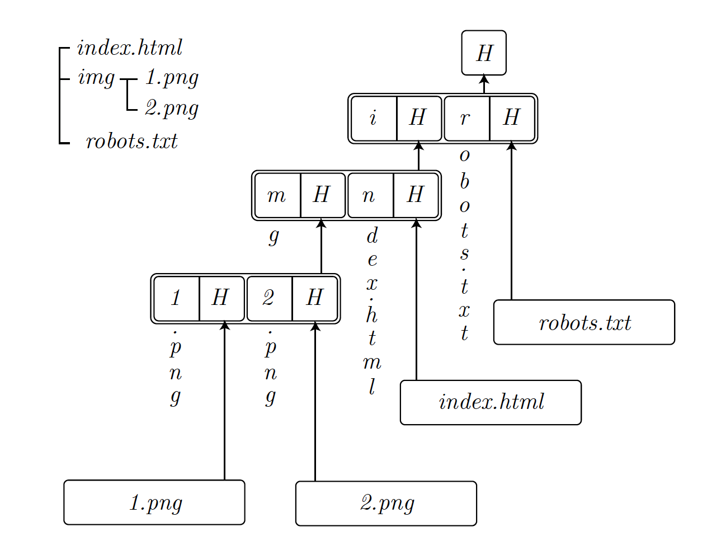
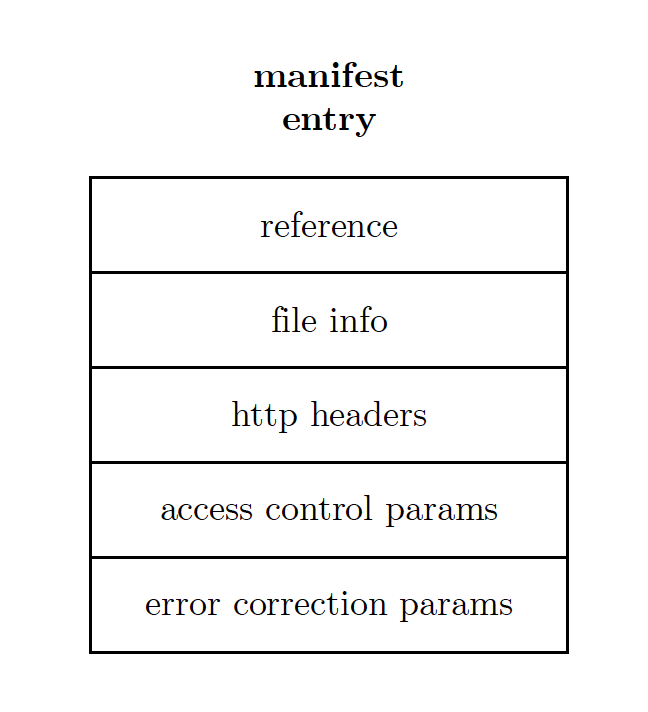

本章建立在分布式块存储的基础上，介绍了数据结构和流程，这些数据结构和流程支持更高级别的功能，以提供处理数据的丰富体验。特别地，我们展示了如何组织块来表示文件(4.1.1)，如何组织文件来表示集合(4.1.2)，引入键值映射(4.1.4)，然后简要讨论了任意函数数据结构的可能性。然后我们将给出提供机密性和访问控制的解决方案(4.2)。
在4.3中，我们引入了Swarm feed，它适用于表示各种顺序数据，例如可变资源的版本更新或用于实时数据交换的索引消息:提供一个持久拉消息传递系统。为了实现各种类型的推送通知，4.4引入了Trojan chunk的新概念，允许将消息伪装成chunk，并将其定向到群中期望的接收者。我们将解释如何将木马块和提要一起使用，以形成具有很强隐私特性的成熟通信系统。

## 4.1 数据结构

在前两章节，我们假设数据以块的形式存在，比如固定大小的数据块。现在我们展示能够表现任意长度数据的算法与数据结构。随后我们会介绍Swarm清单 - 展现集合，索引，和路由表（支持Swarm托管网站和基于URL的寻址）的基础。
#### 4.1.1 文件与Swarm哈希

这一部分，我们介绍Swarm哈希，一种组合数据块以表示更大的结构化数据集（比如文件）的方式。Swarm哈希算法背后的思想是数据块能排列成一棵默克尔树，叶子节点对应输入数据中连续区段的数据块，而中间节点相当于子节点的数据块引用的集合打包而成的另一个块。

图35：Swarm哈希。数据输入以每块4kb分段，以BMT哈希。从Level 0开始它们的哈希值打包进中间块，直到在level n上的单一块。

*分支因子和引用大小*

默克尔数的分支因子通过数据块大小除以引用大小来计算。对于未加密的数据内容，数据块引用就是数据块的32字节的BMT哈希，因此分支因子刚好4096/32=128。一个中间节点引用的一组数据块称为“批”。对于加密数据内容，数据块引用就是数据块哈希与解密密钥的拼接。由于两者都是32字节，因此加密块引用是64字节，分支因子也是64。

图36：中间块。它封装了子数据块的引用。

由此，一个单一数据块能代表Swarm哈希树的中间节点，它的内容能分为多段，其中每一段都是子节点的引用，而每一个子节点引用又可能是中间数据块，参见图36。通过递归的方式从根节点拆解数据块，我们能得到整个数据块序列。

*块宽度和深度完整性*

归于一个中间块下的数据的长度被称为块宽度。为了标识一个块是否是数据块，64位小端字节序表示被前置于块数据。当计算一个块的BMT哈希，这个宽度构成了元数据 - 需要被前置于BMT的根节点并哈希以给予我们块地址。当组装一个文件时，通过查看宽度，我们能知道一个块是数据块，还是中间块：如果宽度大于4K，块是中间块，它的内容需要被解释为一系列子块的哈希；否则，它就是数据块。

理论上，如果文件长度已知，中间块的宽度不是必须的，因为我们可以计算出默克尔树所需的中间层数。然而，使用宽度将禁止恢复中间层为数据层。在这种情况下，我们强调深度完整性。

*追加和恢复退出的上传*

Swarm哈希有一个有趣的属性，任何对应于一个中间块的数据宽度，也是一个文件，因此能被引用，就像这个中间块是它的根节点哈希。这很重要，因为这允许追加到一个文件的同时，保留对前期状态的历史引用，而不重复块，除了在默克尔树的不完整右边缘。追加与基于上传大文件中途的崩溃的恢复上传有关。

*随机访问*

注意，文件中的所有块除了右边缘，是完全填充的。由于块的大小是固定的，对于任何数据偏移，我们都能提前计算出访达的路径，包括在块内搜索的偏移量。正因为此，文件随机访问是支持的。

*文件紧凑包含证明*

假设我们要证明在一个文件内特定偏移量的位置包含了一个子字符串。我们明白，偏移量适用于将数据映射到一条遍历Swarm哈希的确定的路径。因为子字符串包含证明根本地缩减到一系列数据段路径的证明，块地址是BMT哈希的结果，其中基础数据段为32字节长。这意味着中间块中，BMT基础段与子块的地址一致。结果就是，证明一个特定偏移量上的中间块子块的地址，等同于提供在子哈希上的段包含证明。因此，文件中的子字符串包含，能够通过BMT包含证明序列来证明（见7.3.3），其中，序列长度对应于Swarm哈希树的深度（见图38）。

图37：Swarm哈希中基于任意偏移量的随机访问。任意的偏移量告诉我们如何遍历Swarm哈希树。

图38：文件的紧凑包含证明。如果我们需要证明段落i的包含性，在除以32后，我们按照7位一组，找到中间节点的对应段落。

注意，这种包含证明在加密数据中也是可能的，因为解密密钥，能够有选择地获得，同时避免暴露任何可能破坏块中别处加密性的信息。

这一段中，我们展示了Swarm哈希，一种代表文件的块的数据结构，它支持一下功能：

- *随机访问* – 文件能够从任何偏移量访问而不需要额外开销。
- *追加* – 支持追加同时避免重复。
- *长度保留编辑* – 支持长度保留编辑同时避免未修改部分的重复。
- *紧凑包含证明* – 在文件大小的对数空间允许32字节解析度的包含证明.

#### 4.1.2 集合与清单

Swarm清单是一种结构，用来定义任意路径与文件的映射关系，以代表集合。它也包含集合，集合的对象（文件）相关联的元数据。一个清单条目包含一个文件的引用，更精确地说，一个代表文件的Swarm根块的引用。清单条目也指定文件的媒体MIME类型，以便浏览器知道如何处理它。你可以把清单理解为（1）路由表，（2）目录树，（3）索引，这使得Swarm可能实现（1）网站，（2）文件系统目录，（3）键值存储。清单提供了Swarm中使能基于URL的寻址的主要机制。

清单表现为紧凑前缀树，其中树节点序列化为块。路径与至少指定了引用的清单条目相关联。如果这路径是集合中多于一条路径的共同前缀，这引用可能指向一个嵌入式清单，因此实现了前缀树中的分支，见图39。

图39: 清单结构。节点代表一个前缀树节点：它包含了描述共享前缀的延续的分叉。分叉基于键的下一个字节索引，该键值包含子节点的Swarm引用，以及最长前缀

图40: 清单条目是一个包含文件引用的数据结构，包含关于文件或者目录，装载器，访问控制和HTTP头的元数据。

清单条目是封装了关于一个文件或者文件夹的所有元数据的数据结构。信息至少包含，文件的Swarm引用，以及相关文件信息，作为（1）下载组件的参数，用以将块组装进字节流，或者（2）以供浏览器处理客户端渲染，或者（3）映射清单到文件系统目录树。（1）被访问控制信息和擦除编码参数，以及发布者所需的块恢复，所例证。（2）当文件被获取时，包含了内容类型HTTP头，或其他本地Swarm客户端会选取并设置在响应中的HTTP头。以及（3）当下载文件权限时，映射到文件系统中的文件信息。

高阶清单API，提供文件和文件夹上传，下载的功能。它也提供了添加文档到集合，从集合删除文档的接口。值得注意的是，删除仅仅意味着一个新的清单的创建，这个清单中路径是缺失的。Swarm中没有其他删除的概念，比如，被删除的清单所引用的值仍然留存在Swarm中。Swarm以bzz URL的形式提供清单API。

#### 4.1.3 基于URL的寻址和名字解析

我们介绍了作为分布式不可变块存储（DISC，见2.2.1）的Swarm底层网络组件。在前两部分，我们展示了文件和集合在Swarm中如何表示，如何使用块引用。清单提供了索引集合中独立文档的方式，这能让它们被当作Swarm上的网站的表现形式。根清单作为接入点服务为Swarm上虚拟地伺服站点，因此，类似于伺服服务器。在当前的网络上，域名解析到主机的IP地址，静态站点的URL路径映射到相对于主机根目录的相对路径上。类似地，在Swarm中，域名解析到一个根清单的引用，URL路径基于路径映射到清单条目。
当HTTP API服务于一个URL，将完成以下步骤：
1. 域名解析 - Swarm解析主机部分到一个根清单的引用，
2. 清单遍历 - 沿匹配的URL路径，递归遍历嵌入式清单，达到目的清单条目，
3. 伺服文件 - 获取目的清单条目引用的文件，按清单条目元数据中的HTTP头（特别是内容类型）在浏览器中渲染。

Swarm支持采用以太坊名称服务（ENS）做域名解析。ENS是一个类似于传统网络中的DNS的系统，翻译可读的名称为系统特定的标识符，比如，Swarm中的引用。为了使用ENS，Swarm节点需要连接到一个基于EVM，支持以太坊API（ETH主网，Ropsten，ETC，等）的区块链，设置它解析域名为引用。这个引用通常为一个公开（为加密）清单根的内容哈希。这种情况下，这个清单表示一个包含网站资源的文件夹，它的哈希的默认路径可以设为期望的根HTML页面。当一个ENS名字被启用Swarm的浏览器或者网关访问，Swarm会渲染根HTML页面，提供其他相对路径提供的资源。在这种方式下，用户能够轻松的伺服网站，Swarm为较老的已经存在的浏览器提供了接口，以及实现一套DNS上的去中心化的改进。

......

Pss:使用邮箱的直接消息推送
pss是Swarm节点到节点之间直接推送消息解决方案。它存在的功能和动机可以通过这个术语的替代解决方法来好玩地捕捉到:

* 蜂群上的邮政服务：如果收件人在线，则直接发送消息；如果收件人不在线，则为下载预付费用。
* 发送消息，如果收件人是在线或存款下载，如果不是。
  •pss是bzz whisper -除了与中国窃窃私语的联系，它肯定承载了以太坊whisper的精神和愿望。5 pss利用了Swarm的分布式存储块，因此继承了他们传递和持久性的全部激励。同时，它借鉴了Whisper的加密、信封结构和API。
  •pss !指令hush/whisper -唤起不向第三方披露信息的努力，这正是在pss的口号中发现的:真正的零泄漏消息，除了匿名和机密，消息的行为也是不可检测的。
  •发布/订阅系统——API允许发布和订阅一个主题。
  首先，在4.4.1中，我们引入了Trojan chunk，即发送给存储的消息伪装成其内容地址恰好位于目标接收者附近的chunk。4.4.2讨论了使用PSS发送联系信息来打开实时通信通道。在4.4.3中，我们探索了饲料标识符的挖掘，以一个具有单个所有者块地址的邻居为目标，并给出了一个有地址信封的构造。最后，构建木马块并解决